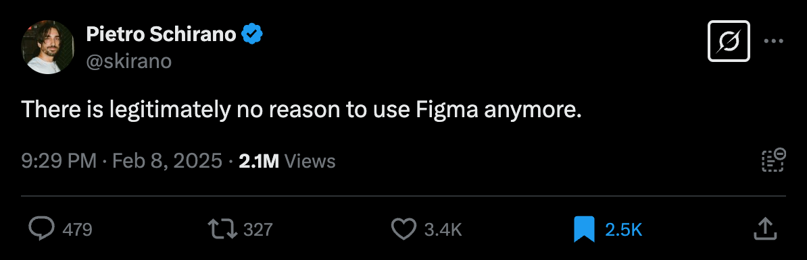
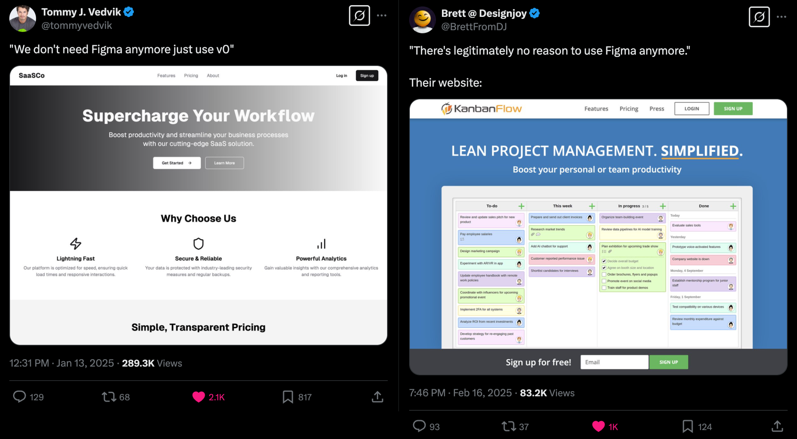
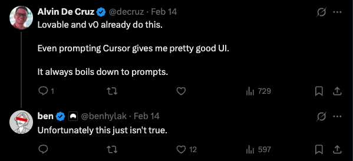
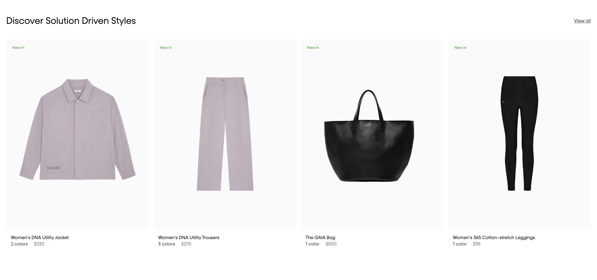
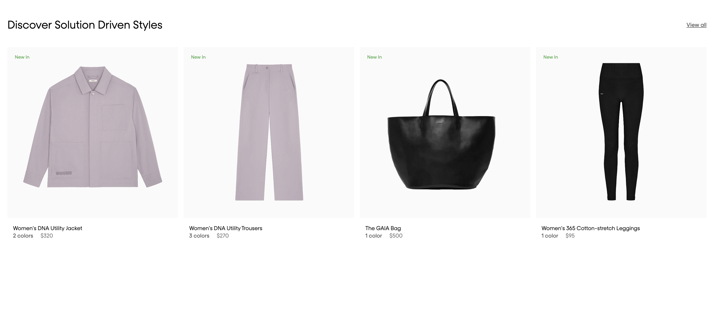

# UI Bench: Measuring AI's Design Understanding

Say hello to UI Bench, a benchmark that tests whether visual LLMs can truly function as UI designers.

We all heard this: designers are doomed, AI took over:



Such opinions are refuted with the same intensity with which they are stated:



With all that noise, it's time to move past opinions and get some hard evidence.

My personal observation is that, while models can generate UI code, they appear to lack understanding of visual details and the "eye for design" crucial for real-world design work. UI Bench measures this by creating a controlled environment where we test if models can identify subtle details in typography, spacing, and layout - essentially, whether they truly "understand design" or "see the details".

> "The details are not the details. They make the design." Every great designer knows it." - Charles Eames

The benchmark is intentionally simple, with room to increase difficulty in future iterations. Even in this basic form, state-of-the-art models struggle with visual tasks that human designers would consider trivial:

```
Model                          Passed     Failed     Total      Pass Rate 
----------------------------------------------------------------------
anthropic_claude-3.7-sonnet    27         77         104        25.96%
openai_chatgpt-4o-latest       8          96         104        7.69%
```

These results show that the models have innate limitations in terms of design understanding, which aligns with my intuition. It's hard to imagine that we can have great design products with off-the-shelf current models, as these fundamental limitations would surely leak through to the final output.



The gap between human designers' visual perception and AI models' understanding of design details remains substantial, even with state-of-the-art systems.


## How it works?

The recipe for the benchmark is very simple:
1. Take the real-world website section from the Internet. Every example must be well-designed, I call it "no-slop rule". If we eval taste, let's use tasteful examples.
3. Recreate it in the simplest possible way (single file with trivial HTML+CSS). The markup and CSS are build to remove visual ambiguity. 
4. Intentionally introduce a design error (margin, padding, border, typography, etc)
5. Take screenshot of reference and incorrect designs at the single desktop resolution (`1536px`)
6. Ask the model to correct the code of incorrect design by looking at the incorrect and reference screenshot.
7. Key constraint: model can only change values of existing CSS properties. It can't modify HTML, nor add/remove CSS properties.

Evaluation:
1. Identify whether model picked the right CSS properties responsible for the error.
2. Render both reference and result pages in headless browser, calculate [computed styles](https://developer.mozilla.org/en-US/docs/Web/API/Window/getComputedStyle) for the tested CSS properties.
8. Compare the computed values with some tolerance (if 100px is correct then 99px will also be accepted). 

You can read the full prompt [here](./eval_prompt.py).

#### Example 1 

Here's a very nice section from [linear.app](linear.app) website:


And here's its HTML:

```html
<html lang="en">
 <head>
  <meta charset="utf-8"/>
  <meta content="width=device-width, initial-scale=1.0" name="viewport"/>
  <title>
   Discover Solution Driven Styles
  </title>
  <style id="global-styles">

    @font-face {
        font-family: "Inter Variable";
        src: url("/linear/fonts/InterVariable.woff2");
        font-style: normal;
        font-weight: 100 900;
    }

    @font-face {
        font-family: "Inter Variable";
        src: url("/linear/fonts/InterVariable-Italic.woff2");
        font-style: italic;
        font-weight: 100 900;
    }

    * {
        margin: 0;
        padding: 0;
        box-sizing: border-box;
        -webkit-font-smoothing: antialiased;
    }

    body {
        margin-left: 0;
        margin-right: 0;
        margin-top: 0;
        margin-bottom: 0;
        padding-top: 40px;
        padding-bottom: 40px;
        background-color: #000212;
    }
    </style>
    <style id="page-styles">
    .container {
        max-width: 1024px;
        margin-left: auto;
        margin-right: auto;
    }

    .bannerCentered {
        display: flex;
        justify-content: center;
        align-items: center;
        position: relative;
    }

    .bannerCentered__background {
        width: 100%;
        object-fit: cover;
        aspect-ratio: auto;
    }

    .bannerCentered__content {
        position: absolute;
        top: 0;
        left: 0;
        right: 0;
        bottom: 0;
        display: flex;
        flex-direction: column;
        justify-content: center;
        align-items: center;
        backdrop-filter: blur(1px);
    }

    .bannerCentered__title {
        font-family: "Inter Variable";
        font-size: 56px;
        font-weight: 500;
        line-height: 1.111;
        color: #f7f8f8;
        margin-bottom: 24px;
        text-align: center;
    }

    .bannerCentered__description {
        font-family: "Inter Variable";
        font-size: 17px;
        line-height: 1.4;
        font-weight: 400;
        color: rgb(180, 188, 208);
        text-align: center;
    }

    .bannerCentered__backgroundBlur {
        position: absolute;
        inset: 0px;
        opacity: 0.6;
        filter: blur(140px);
        background: radial-gradient(ellipse 200px 200px at 30% 40%, #3360ff, transparent), radial-gradient(200px 200px at 70% 60%, #3360ff, transparent);
    }

    .link {
        font-weight: 500;
        color: rgb(130, 143, 255);
        text-decoration-line: none;
    }

    .bannerCentered__buttonGroup {
        display: flex;
        flex-direction: row;
        gap: 16px;
        margin-top: 24px;
    }

    .buttonLink {
        display: flex;
        justify-content: center;
        align-items: center;
        position: relative;
        font-family: "Inter Variable";
        font-size: 16px;
        font-weight: 500;
        line-height: 1;
        text-decoration-line: none;
        color: white;
        height: 48px;
        background-color: #5e6ad2;
        border-radius: 8px;
        padding-left: 18px;
        padding-right: 18px;
    }

    .buttonLink--secondary {
        background-color: rgba(255, 255, 255, 0.15);
        border-color: rgba(255, 255, 255, 0.15);
        border-width: .5px;
        border-style: solid;
    }
  </style>
 </head>
 <body>
  <div class="container">
   <div class="bannerCentered">
    
    <div class="bannerCentered__backgroundBlur">
    </div>
    <div class="bannerCentered__content">
     <h3 class="bannerCentered__title">
      Activate Insights
      <br/>
      for your team
     </h3>
     <p class="bannerCentered__description">
      Insights is available on the
      <a class="link" href="#">
       Linear Business
      </a>
      plan.
      <br/>
      Upgrade today or get in touch with our Sales team.
     </p>
     <div class="bannerCentered__buttonGroup">
      <a class="buttonLink buttonLink--primary" href="#">
       Get started
      </a>
      <a class="buttonLink buttonLink--secondary" href="#">
       Talk to sales
      </a>
     </div>
    </div>
   </div>
  </div>
 </body>
</html>
```

Let's introduce a visual error: decrease button height from `48px` to `28px`. This can be done with a single CSS property modification:

```css
.buttonLink {
    height: 28px;
}
```

The visual error is trivially visible:


Let's see Claude Sonnet 3.7 response:

```json
{
    "css_changes": {
        ".buttonLink": {
            "height": "40px"
        }
    },
    "reasoning": "The main visual difference between the incorrect and correct design is in the height of the buttons. In the incorrect design, the buttons are shorter than in the correct design. Looking at the CSS, the height of the buttonLink class needs to be increased to match the correct design.",
}
```
✅ Correct! The model correctly identified the CSS property that needs to be changed (`.buttonLink { height }`) and that it should be increased. The model set `40px` instead of `48px` but it's within the accepted tolerance of 25%.

#### Example 2

Here's a products grid section from a great e-commerce [Pangaia](pangaia.com):



You can check out the HTML code [here](./data/pangaia/pages/section1/generated/reference.html).

Let's introduce a simple visual error - wrong image aspect ratio:

```css
.card__image: {
    aspect-ratio: 1/1;
}
```

The "bad" section looks like this:



Let's check `openai/chatgpt-4o-latest` response (as of March 12th):

```json
{
    "css_changes": {
        ".header__title": {
            "font-weight": "400"
        }
    },    
    "reasoning": "The incorrect design's header title appears smaller in weight compared to the correct design. After reviewing the CSS, the header's title is currently set to 'font-weight: 300', whereas in the correct design, it should be 'font-weight: 400'. Adjusting this will ensure the title has the intended prominence.",

}
```
❌ Wrong! The model seems to think that the error is title weight (which didn't change), not the image aspect ratio. A complete hallucination.

You can browse all the examples in a user-friendly form [here](https://ui-bench.onrender.com/)

## Does it measure the right thing? How to measure design?

Before answering this question, I'd like to classify the design process into 3 categories:

1. **Level 1 - from blank page to something.** Defining typography, colors, visual style, etc. It's the most creatvie/artsy part and actually closer to branding than actual UI design. We can assume that it ends up with a bunch of screens that are enough to understand the visual style.
2. **Level 2 - extending existing design system.** This level is about scaling a couple of initial designs into hundreds of new visually consistent screens. It's not *that* creative, but still require great taste. This phase is very UX-heavy.
3. **Level 3 - from design to code**. Design must be implemented in code ("figma to code" phase). Actually, code aside, this task could be reframed as "copying the design". You see a screenshot of the design (goal) and the job is to implement it in new environment (code) so that it looks pretty much the same.

Evaluating Level 1 and Level 2 would be very hard, it's similar to evaluating writing quality. It's more about "vibes" than about 0-1 verifiability. That's why UI Bench focuses on Level 3.

But does it give us any valuable signal? How hard can be copying the design?

I'd argue that it's a very valuable signal. I'm a design engineer and co-founder of [commerce-ui.com](https://commerce-ui.com), for most of my career I worked closely with world-class designers to bring their ideas to code. I've seen a following situation like a billion times: designer hands over design to a developer, developer does some work and thinks it's finished, designer looks at it and there are like 100 design bugs. Spacings, colors, typography, icons, a lot of stuff that just makes everything off. And so the never-ending designer-developer feedback loop begins (it costs a lot of $).

However, designers and great design engineers see those details right away. They don't need to check the exact amount of pixels of the specific spacing. Or check the exact font size. **They just see** by looking at the rendered pixels only. It's either off or it's not. It's an intuitive process. And **this intuition** is a true "design understanding".

Of course we can check exact font sizes, spacings etc in Figma. But it's *purposefully* not what we're looking for. We're trying to evaluate whether vLLM has a proper design intuition so that it can recreate design "just from pixels", without any extra data. I believe this is a very good test for true "design understanding" and I know that designers and great design engineers would pass this test, while many other folks wouldn't. If you can look at 2 screenshots and right away spot that font-size is 13px and not 12px or that the letter spacing is 1% off then hey, you have a good eye for design. This is exactly what UI Bench tries to measure. I think it's a very important test to check whether the visual models have a correct internal representation of UI design.

## Verifiability and evaluation

The simplest benchmark would to feed the model with "design.png" file, ask the model the recreate it with code (i.e. HTML+CSS) and verify whether the result is correct. The problem is that such verification is hard for 2 reasons:
- visual tolerance
- code ambiguity

### Comparing pixels - a tolerance problem

There's no algorithm I'm aware of that can take 2 design screenshots and say whether they implement the same design. The trivial approach would be to compare pixels (even with addition of some fancy algos) but this approach would produce a lot of false negatives. The reason is that minor pixel differences doesn't change the subjective feeling that design is OK. If you change font-size from 60px to 61px no one will notice. Same with changing font-weight from 400 to 405. Particularly problematic are big gaps, margins or heights (100px+) as even 10px differences are not really that noticable and shouldn't be often treated as errors. And those errors can add up pretty quickly.

### Comparing code - an ambiguity problem

There are probably hundreds of ways in HTML/CSS to achieve the same design. You can structure your HTML differently or you can use various CSS properties to achieve the same result. You can use `grid` instead of `flex`, you can use `margin` instead of `padding`, `margin-top` of lower element instead of `margin-bottom` of upper element etc.

In comparing code, the tolerance problem also exists. If the margin is 101px instead of 100px, even the best designer won't see the difference, which means that both values are essentially correct.

### UI Bench approach

UIBench uses code-level verification, so let's discuss how it solves these problems.

#### Ambiguity 

In order to solve Ambiguity problem we do 3 things:

1. Manually craft the examples so that there can be **only one** CSS property responsible for a design error. For example, if we introduce an incorrect gap between cards in a grid - `1px` instead of `32px` via the `gap` CSS property of the parent component, we ensure no other CSS property can be used to change this gap. In a normal scenario, you could alternatively use `margin-left`, `margin-right`, `padding-left` or `padding-right` of the child card components, which is why our test cases are built so that such alternative properties simply do not exist in the stylesheet.
2. We introduce the following constraint in the prompt: 
    > Model can only change values of existing CSS properties. It can't modify HTML, nor add/remove CSS properties.

    It means that the model is allowed to change only the values of existing CSS properties. It can't change HTML and it can't add/remove existing CSS properties. This together with 1. assures that there's only **one possible property responsible for the error**. For our grid gap example above this property is a `gap`, as this constraint makes sure that `margin-left`, `margin-right`, `padding-left` or `padding-right` properties *can't* be added to the card styles.
3. Even if we assured unambiguity on the CSS property level, there's still ambiguity on the CSS property **value** level:   
    - Setting the `margin-bottom` value to `96px` or `6rem` might lead to the same look.
    - `grid-template-columns` set to `1fr 1fr 1fr 1fr` or to `repeat(4, 1fr)` are synonims.
    - etc
    
    In order to solve it we render both result and reference HTML in a real browser (headless Chrome) and use [Window.getComputedStyle](https://developer.mozilla.org/en-US/docs/Web/API/Window/getComputedStyle) browser API to calculate **computed values**, which assures values normalisation (i.e. for `margin`, the values are always in `px`, unless ofc `auto` or other special value is used).

#### Tolerance

The Tolerance problem is solved simply by introducing an accepted level of tolerance. For example, if reference value is `13px` and model outputs `12px` the difference of ~8%. Our tolerance is set to 25% so it wouldn't be treated as an error. For CSS properties like `display` which has only predefined set of values (`block`, `flex`, `grid`, `none` etc) we obviously check exact match. The tolerance values are available in [css_properties.py](./css_properties.py).

It must be said that this approach has limitations:
1. There's a certain level of arbitrariness. Let's say we look at a full-width website section with `padding-top` and `padding-bottom` with large value of `200px`. We can safely assume that no-one will spot if the value is `199px` and that everyone will see if it's `10px`. However, it's impossible to say where *exactly* the boundary is, is it 5%, 10%, etc. It's subjective.
2. For certain visual contexts even tiny changes, well within tolerance, are very clearly visible. Let's say the page background is white `#ffffff` and there are cards with very light grey background `#fafafa`. The numerical distance between these colors is very small (2%), but because of the clear contrast with the background, it's still extremely well visible.

It must be acknowledged that this trivial comparison method with tolerance has clear limitations and can lead to false positives if tolerance is too large, or false negatives, if tolerance is too small.

In this version of UIBench we opt for larger tolerance and accept potential false positives. We think that until the benchmark is close to saturation (it's far from it yet), it's not a reason for concern.

### Responsiveness

For the first version of this benchmark we dropped responsiveness completely. One resolution makes everything simpler and is enough to test whether model has a good design understanding.

That can be easily expanded in the future.

### The textual representation of design - why HTML/CSS?

The benchmark like UIBench wouldn't be possible without textual design representation. In the end, whatever task we present to the model, it responds with text that relates to the design and we run evaluation script on the text response. The representations could be plain English, geometric, or code.

1. **Plain language.** We could ask the model to find a design error and answer in plain English like: "the gap between first and second card is too small", "the title in the stack should be larger", etc.
2. **Geometric.** The design representation in most design programs are basically rectangles with their width, height, position coordinates and depth.
3. **Code.** This is the most common design representation used by developers in their everyday work. Examples are HTML+CSS, HTML+Tailwind, Apple Visual Format Language (`|-50-[purpleBox]-50-|`), etc. 

Textual representation was dropped for obvious reasons, plain language is not specific and therefore hard to evaluate.

Geometric representation was dropped because of the following reasons:
- there's no "standard" format of this kind, so we can't really rely on model having a deep understanding of the format.
- although that might be unnecessary anthropomorhphisation, it seems unfair to ask the model to reason in the domain that humans simply don't.
- even small design change results in **a lot** of changes, which unnecessarily complicates the task

The remaining options were code. We picked HTML/CSS as we feel it's the most well-represented format (kind of like SQL for database queries). Additionally we focused on preparing the examples with ultra-simple HTML/CSS. The reason is that we want to test model visual understanding, not coding skills. If we copy-pasted very complex HTML/CSS directly from the website, without any clean-up, often in compiled form, we could end up with false negative answers. Even if model have a proper visual understanding it might provide a wrong answer because of insufficient code understanding or poorer reasoning over large context.

### Test case selection

For the first version of this benchmark I recreated 9 sections and introduced 5-20 errors in each of them. You can browse all the test cases [here](https://ui-bench.onrender.com/).

Full pages could be also used but I preferred to focus on single sections not to bloat the context unnecessarily.

The design errors are trivial and mostly result in 1-3 CSS properties changed. This could be later expaneded to modifying much more than 1 or 2 CSS properties, but for the first iteration I wanted to keep it simple.

## (TO-DO) Agentic Design Loop 

This section will run the eval in the "agentic loop":
1. Model proposes a CSS change.
2. It gets the screenshot of its proposition.
3. Model can decide whether it's OK, or can go back to 1 to try again.

Important points:
- model sees entire history of changes
- max amount of trials should be limited to ~5 not to overload cotext too much.

This simulates real world environment when dev changes code and keep browser open to see the effect. There must be a feedback loop here. 

## Understanding prompts with multiple images

Before we start evaluating models for visual understanding, there's one more crucial consideration. This benchmark is based upon a prompt that contains multiple images interleaved with their textual labels. Even in the most minimalistic setup you need a reference screenshot and current screenshot. There's also a huge additional value in providing more screenshots to help model visualise its own actions in Agentic Design Loop as discussed above.

Using the prompt with multiple images interleaved with text raised my suspicion. I haven't seen any benchmark that tests for such capabilities. Almost all vLLM applications I've seen include single image and checks for single image understanding.

In [text_image_order_bench/](./text_image_order_bench/) directory there's a mini-benchmark that trivially checks for such understanding. The method is very simple:
1. Take "obvious" photos of "obvious" animals: cat, dog, pig and cow.
2. Create 100 test cases, animals' images and labels are interleaved in a single prompt. The test cases include examples of correct and incorrect matching.
4. Check whether the model can correctly determine whether the matching is correct or not.

The test is so trivial that very high correctness is expected. But the results are surprising:

```
Model ID                                      | Success % 
--------------------------------------------- | ----------
openai/chatgpt-4o-latest                      | 100.00%
anthropic/claude-3.7-sonnet                   | 100.00%
google/gemma-3-27b-it                         | 81.00%
qwen/qwen-vl-max                              | 78.00%
meta-llama/llama-3.3-70b-instruct             | 78.00%
qwen/qwen-vl-plus                             | 77.00%
mistralai/pixtral-large-2411                  | 77.00%
qwen/qwen2.5-vl-72b-instruct                  | 76.00%
mistralai/pixtral-12b                         | 75.00%
deepseek/deepseek-chat                        | 65.00%
openai/o1-mini                                | 62.00%
google/gemini-2.0-flash-001                   | 34.00%
mistralai/mistral-small-24b-instruct-2501     | 27.00%
```

Only 4o and Claude Sonnet have 100% accuracy.

The results of this section suggest that most of the models fail on a trivial task - understanding of multiple-image prompts. Even if the model has perfect design understanding but fails to reason over multiple images, this benchmark might yield negative results. Therefore, we only evaluate models that score 100% on this mini-bench.

## Results

```
Model                          Passed     Failed     Total      Pass Rate 
----------------------------------------------------------------------
anthropic_claude-3.7-sonnet    27         77         104        25.96%
openai_chatgpt-4o-latest       8          96         104        7.69%
```
